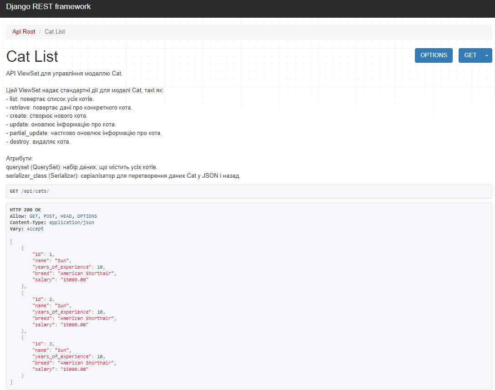

# Spy Cat Agency API

## Огляд
Це RESTful API для управління шпигунськими котами, їхніми місіями та цілями.




## Технології
- Django REST Framework
- PostgreSQL
- TheCatAPI (інтеграція)

## Встановлення
1. Клонувати репозиторій:
   ```bash
   git clone https://github.com/VAlduinV/SCA.git
   cd spy_cat_agency

## Створити віртуальне середовище
Віртуальне оточення venv:
```bash
    python -m venv venv
```

Активація (Linux/Mac):
```bash 
    source venv/bin/activate  # для Linux/Mac
```
 
Активація (Windows):  
```bash  
    venv\Scripts\activate     # для Windows
```

Встановити залежності:
```bash
pip install -r requirements.txt
```

Віртуальне оточення poetry:
```bash
    poetry init
```

Активація:
```bash
    poetry shell
```

Інсталювати залежності:
```bash
  poetry install
```

Налаштувати базу даних у settings.py:
```
DATABASES = {
    'default': {
        'ENGINE': 'django.db.backends.postgresql',
        'NAME': 'your_db',
        'USER': 'your_user',
        'PASSWORD': 'your_password',
        'HOST': 'localhost',
        'PORT': '5432',
    }
}
```

Виконати міграції:
```bash
  python manage.py migrate
```

## Тестування API

Для тестування API використовуйте колекцію Postman. Завантажте колекцію за посиланням:
[Postman Collection](https://app.getpostman.com/join-team?invite_code=a104e00c1c57b8a12af0c18c0f4c3c862c5fef1adfad22a0220860257d129749).

### Ендпоінти

#### Коти:
- **GET /api/cats/**: повертає список котів.
  - **Приклад відповіді**:
    ```json
    [
        {
            "id": 1,
            "name": "Shadow",
            "years_of_experience": 5,
            "breed": "Bengal",
            "salary": 5000.00
        },
        {
            "id": 2,
            "name": "Mittens",
            "years_of_experience": 3,
            "breed": "Sphynx",
            "salary": 4000.00
        }
    ]
    ```
- **POST /api/cats/**: додає нового кота.
  - **Тіло запиту**:
    ```json
    {
        "name": "Shadow",
        "years_of_experience": 5,
        "breed": "Bengal",
        "salary": 5000.00
    }
    ```
  - **Приклад відповіді**:
    ```json
    {
        "id": 1,
        "name": "Shadow",
        "years_of_experience": 5,
        "breed": "Bengal",
        "salary": 5000.00
    }
    ```
- **PATCH /api/cats/{id}/**: оновлює зарплату кота.
  - **Тіло запиту**:
    ```json
    {
        "salary": 5500.00
    }
    ```
  - **Приклад відповіді**:
    ```json
    {
        "id": 1,
        "name": "Shadow",
        "years_of_experience": 5,
        "breed": "Bengal",
        "salary": 5500.00
    }
    ```
- **DELETE /api/cats/{id}/**: видаляє кота.

---

#### Місії:
- **GET /api/missions/**: повертає список місій.
- **POST /api/missions/**: створює місію разом із цілями.
  - **Тіло запиту**:
    ```json
    {
        "targets": [
            {"name": "Target 1", "country": "France", "notes": ""},
            {"name": "Target 2", "country": "Germany", "notes": ""}
        ]
    }
    ```
  - **Приклад відповіді**:
    ```json
    {
        "id": 1,
        "is_completed": false,
        "targets": [
            {"id": 1, "name": "Target 1", "country": "France", "notes": "", "is_completed": false},
            {"id": 2, "name": "Target 2", "country": "Germany", "notes": "", "is_completed": false}
        ]
    }
    ```
- **PATCH /api/missions/{id}/assign/**: призначає місію коту.
  - **Тіло запиту**:
    ```json
    {
        "cat_id": 1
    }
    ```
  - **Приклад відповіді**:
    ```json
    {
        "detail": "Mission 1 assigned to Cat 1"
    }
    ```

---

#### Цілі:
- **PATCH /api/targets/{id}/notes/**: оновлює нотатки для цілі.
  - **Тіло запиту**:
    ```json
    {
        "notes": "Target observed near the Eiffel Tower."
    }
    ```
  - **Приклад відповіді**:
    ```json
    {
        "id": 1,
        "name": "Target 1",
        "country": "France",
        "notes": "Target observed near the Eiffel Tower.",
        "is_completed": false
    }
    ```
- **PATCH /api/targets/{id}/complete/**: позначає ціль як завершену.
  - **Приклад відповіді**:
    ```json
    {
        "detail": "Target Target 1 marked as completed"
    }
    ```
